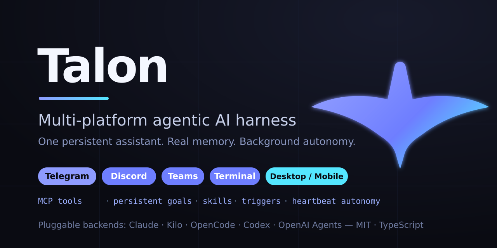

<p align="center">
  
</p>

# Talon

[](https://nodejs.org)
[](https://bun.sh)
[](https://www.typescriptlang.org/)
[](#frontends)
[](#backends)
[](LICENSE)
[](https://github.com/dylanneve1/talon/actions/workflows/ci.yml)
[](https://github.com/sponsors/dylanneve1)

Multi-platform agentic AI harness. Runs on **Telegram**, **WhatsApp**, **Discord**, **Microsoft Teams**, the **Terminal**, and a **cross-platform Desktop/Mobile companion app** (Flutter), with a pluggable backend (**Claude Agent SDK**, **Kilo**, **OpenCode**, **Codex**, or **OpenAI Agents**) and full tool access through MCP.

---

## Features

|                       |                                                                                                                                              |
| --------------------- | -------------------------------------------------------------------------------------------------------------------------------------------- |
| **Multi-frontend**    | Telegram (grammY + GramJS userbot), WhatsApp (Baileys multi-device), Discord (discord.js), Microsoft Teams (Bot Framework), Terminal with live tool visibility, and a **Desktop/Mobile app** (Flutter) over a local/remote bridge — one or several at once, see [Frontends](#frontends) |
| **Pluggable backend** | Claude Agent SDK, Kilo, OpenCode, Codex, OpenAI Agents — selectable per-process via `backend` config. Streaming, model fallback, context-overflow recovery. |
| **MCP tools**         | Messaging, media, history, search, web fetch, cron jobs, triggers, goals, stickers, file system, admin controls                              |
| **Plugins**           | Hot-reloadable plugin system with `talon plugin install/enable/disable` (npm, git, or local sources). Built-in: GitHub, MemPalace, Playwright, Brave Search |
| **Background agents** | Heartbeat (hourly by default — advances goals, proactively messages when something matters) and Dream (memory consolidation + diary)         |
| **Goals**             | Persistent multi-day objectives the agent commits to in chat; every heartbeat run re-reads them, makes progress, and records what it did     |
| **Skills**            | SKILL.md workflow bundles the agent authors and reuses, with `talon skill install/enable/disable` (local folders, git, or `owner/repo` — the Anthropic skills ecosystem installs directly) |
| **Triggers**          | Self-authored watcher scripts (bash/python/node) that wake the bot when conditions are met                                                   |
| **Task table**        | Every unit of agent work — chat turns, heartbeat, dream, isolated cron/trigger jobs — registered live; `talon ps` / `talon kill`             |
| **Event bus**         | Typed internal pub-sub spine (task + turn lifecycle events); subsystems subscribe instead of importing each other; `talon events -f`         |
| **VFS**               | Unified namespace at `~/.talon/ns` over workspace, skills, scripts, logs, plus /proc-style live views of the task table, event bus, and plugin registry — a real filesystem (FUSE-backed live views), so plain `ls`/`cat` and every tool just work |
| **Per-chat settings** | Model, effort level, and pulse toggle per conversation via inline keyboard                                                                   |
| **Model registry**    | Models discovered from the active backend at startup — new models appear in all pickers automatically                                        |

---

## Quick Start

```bash
git clone https://github.com/dylanneve1/talon.git && cd talon
npm install

# Interactive setup (select frontend, configure tokens, pick model)
npx talon setup

# Start
npx talon start       # configured frontend (daemon mode)
npx talon chat        # terminal chat mode
```

**Prerequisites:**

- [Bun 1.3+](https://bun.sh) **or** [Node.js 24+](https://nodejs.org/). Talon ships as
  TypeScript sources and runs them directly: Bun executes them natively, Node goes
  through a `tsx` loader. The `talon` launcher detects which runtime started it, so
  either works with no configuration — `npm start` / `npm run dev` take the Bun path,
  `npm run start:node` / `npm run dev:node` the Node one. Bun is what the release
  binaries and the maintained deployment run on; Node stays supported.
- Backend-specific:
  - `claude` backend: [Claude Code](https://docs.anthropic.com/en/docs/claude-code) installed and authenticated (`claude` CLI on PATH).
  - `kilo` backend: nothing extra — `@kilocode/sdk` spawns a local server. Free models are accessible without auth; routed models use Kilo's own credentials.
  - `opencode` backend: nothing extra — `@opencode-ai/sdk` spawns a local server.
  - `codex` backend: install the `codex` CLI (`npm i -g @openai/codex`) and authenticate with `codex login`, `CODEX_API_KEY`, `TALON_CODEX_KEY`, or `codexApiKey`. `OPENAI_API_KEY` is used only as a fallback when no Codex login exists.

### Standalone binary

Each release also ships self-contained binaries (no Node.js required) for
Linux and macOS (x64 + arm64) and Windows (x64). Prompts and all native
modules are embedded in the binary.

```bash
# Homebrew (macOS / Linux)
brew install dylanneve1/talon/talon

# Debian / Ubuntu — download the .deb for your arch from the release, then:
sudo apt install ./talon_<version>_amd64.deb     # or _arm64.deb

# Direct download — grab talon-<os>-<arch> from the release, verify, run:
chmod +x talon-linux-x64 && ./talon-linux-x64 --version
# macOS, if Gatekeeper blocks an unsigned binary:
xattr -d com.apple.quarantine ./talon-darwin-arm64
```

Verify a direct download against the release `SHA256SUMS`:
`sha256sum -c SHA256SUMS --ignore-missing`.

> The binary runs the full interactive/agent CLI (`setup`, `start`, `chat`,
> `doctor`, …) and supervises MCP children like any other install shape. The one
> gap: a plugin shipping its MCP server as TypeScript source (`mcpServerPath`)
> needs a runtime that can execute TS, which a compiled binary is not — those
> want the npm install. Plugins declaring an explicit `mcpServer` command work
> everywhere.

---

## Architecture

```
index.ts                    Composition root
  |
  +-- core/                 Platform-agnostic engine
  |   +-- agent-runtime/    Backend capability interface, events, stores
  |   +-- frontend-runtime/ Frontend capability interface + descriptor registry
  |   +-- models/           Model layer: catalog, per-chat active model,
  |   |                     reasoning-effort vocabulary
  |   +-- prompt/           System-prompt assembly + prompts/system templates
  |   +-- background/       Agents that run without a user message:
  |   |                     heartbeat, dream, pulse, cron, triggers
  |   +-- tools/            MCP tool definitions + spawn/env contract
  |   +-- mcp-hub/          Daemon-hosted MCP over streamable HTTP; supervises
  |   |                     stdio children with respawn-and-backoff
  |   +-- engine/           Message flow: dispatcher (per-chat serial,
  |   |                     cross-chat parallel), HTTP gateway for MCP
  |   |                     tool calls, backend lifecycle controller
  |   +-- weaver/           Per-chat live state: a Weaver owns Looms own Threads
  |   +-- tasks/            Task table — the process table for agent work
  |   +-- bus/              Typed pub-sub spine + event journal
  |   +-- vfs/              The talon:// namespace (~/.talon/ns), FUSE-backed
  |   +-- mesh/             Device mesh: presence, exec/fs channel, teleport
  |   +-- soul/             Soul kernel — associative recall over memory
  |   +-- scripts/          Run-to-completion execution of saved scripts
  |   +-- scripting/        WASM-sandboxed Lua runner for trigger scripts
  |   +-- daemon/           Start / stop / restart, pidfile, discovery
  |   +-- plugin/           Plugin loader, registry, hot-reload
  |   +-- update/           Self-update for git-checkout deployments
  |
  +-- backend/
  |   +-- registry.ts       Bootstrap-decoupled backend lookup
  |   +-- shared/           Cross-backend helpers (stream state, flow violation,
  |   |                     delivery contract, metrics, prompt format,
  |   |                     model retry, system prompt, usage)
  |   +-- remote-server/    Shared infrastructure for agent-server backends
  |   |                     (MCP registration, sessions, providers, lifecycle)
  |   +-- claude-sdk/       Claude Agent SDK (in-process MCP, hooks)
  |   +-- kilo/             Kilo HTTP server backend (streaming via SSE)
  |   +-- opencode/         OpenCode HTTP server backend
  |   +-- codex/            Codex CLI backend (`@openai/codex-sdk`)
  |   +-- openai-agents/    OpenAI Agents SDK backend (Responses API)
  |
  +-- frontend/
  |   +-- factories.ts      Attaches each built-in's lazy `create`
  |   +-- shared/           Cross-frontend presentation helpers
  |   +-- telegram/         grammY bot + GramJS userbot
  |   +-- whatsapp/         Baileys multi-device socket
  |   +-- discord/          discord.js v14
  |   +-- teams/            Bot Framework + Graph API
  |   +-- terminal/         Readline CLI with tool call visibility
  |   +-- native/           Client bridge (HTTP + SSE) for the companion app
  |
  +-- native/               WASM + napi cores (blake3, strsim, textops, sqlguard,
  |                         htmlents, scheduler, fusefs, warden), each with a
  |                         pure-TS or wasm fallback
  +-- storage/              SQLite layer: sessions, history, chat settings, cron,
  |                         media index, metrics, goals, skills, kv, daily logs
  +-- util/                 Config, logging, workspace, paths, time, runtime
```

**Dependency rule:** `core/` imports nothing from `frontend/` or `backend/`. Frontends and backends depend on core types, never on each other. All five backends (Claude SDK, Kilo, OpenCode, Codex, OpenAI Agents) implement the same `Backend` capability interface from `core/agent-runtime/capabilities.ts`. Frontends mirror this: each implements the `Frontend` contract from `core/frontend-runtime/capabilities.ts` and self-registers in the frontend registry (identity + chat-id routing in a descriptor, lazy `create` in a per-frontend `factory.ts`) — see [docs/frontends.md](docs/frontends.md). Kilo and OpenCode additionally share the `remote-server/` infrastructure because they wrap forks of the same upstream HTTP agent server.

**Prompts:** everything the model reads at session start is assembled by `core/prompt/` from the files in `prompts/` — see [prompts/README.md](prompts/README.md) for the assembly order, file ownership (user-editable vs package-owned templates), and the per-backend delivery contracts.

---

## Frontends

Select via the `frontend` field in `~/.talon/config.json` — one id, or an array to run several at once. Every frontend implements the same `Frontend` contract and registers a descriptor (identity + which chat ids it owns) in the frontend registry, so a chat id routes to its owning frontend with no central switch — see [docs/frontends.md](docs/frontends.md).

| Frontend   | `frontend` value | Transport                                    | Notes                                                                                                                                            |
| ---------- | ---------------- | -------------------------------------------- | -------------------------------------------------------------------------------------------------------------------------------------------------- |
| Telegram   | `"telegram"`     | grammY long-poll (+ optional GramJS userbot) | The widest surface: inline keyboards, reactions, media groups, stickers, polls, admin commands. `apiId` / `apiHash` add userbot history access.  |
| WhatsApp   | `"whatsapp"`     | Baileys multi-device (WebSocket)             | Drives a real WhatsApp account, paired by phone code or QR. Media, reactions, edits, deletes, forwards, polls, locations, contacts, group admin. |
| Discord    | `"discord"`      | discord.js v14 gateway                       | Slash commands, guild / channel allowlists, presence text.                                                                                       |
| Teams      | `"teams"`        | Bot Framework + Graph API                    | Inbound over a Power Automate webhook, outbound over Graph.                                                                                      |
| Terminal   | `"terminal"`     | Local readline                               | Always available via `talon chat`, even when another frontend is configured. Live tool-call visibility.                                          |
| Native     | `"native"`       | HTTP + Server-Sent Events bridge             | The protocol the Flutter companion app speaks — see [Desktop & mobile app](#desktop--mobile-app).                                                |

Running several is just an array; each chat id keeps its own session and the frontend that owns it answers:

```jsonc
{ "frontend": ["telegram", "whatsapp", "native"] }
```

### WhatsApp

The WhatsApp frontend drives a real WhatsApp account over Baileys multi-device — the same mechanism as WhatsApp Web, so no Business API account is involved.

```jsonc
// ~/.talon/config.json
{
  "frontend": "whatsapp",
  "whatsapp": {
    // The bot account's own number, E.164 digits, no "+". Omit for QR pairing.
    "pairingNumber": "353871234567",
    // Who may DM it — bare numbers or full JIDs. Empty disables DMs.
    "allowedJids": ["353834733284"],
    // Which groups it serves: "listed" | "with-allowed-user" | "all"
    "groupPolicy": "with-allowed-user",
    // In groups: reply only when mentioned/quoted, or to everything
    "respondMode": "mention"
  }
}
```

First start prints a pairing code (or a QR when `pairingNumber` is omitted) — enter it under **WhatsApp → Linked devices → Link with phone number**. Credentials persist in `~/.talon/whatsapp-auth/`, so later starts reconnect on their own, with backoff across drops.

`groupPolicy: "with-allowed-user"` is the useful middle setting: the bot serves any group containing someone from `allowedJids` — "the groups I'm in" — without listing group JIDs by hand.

Markdown from the model is translated into WhatsApp's own dialect (`*bold*`, `_italic_`, `~strike~`, monospace blocks) by walking the parsed token tree rather than by regex, and long replies split on message boundaries instead of truncating.

---

## Backends

Select via the `backend` field in `~/.talon/config.json`. All backends implement the same `Backend` capability interface — heartbeat, dream, and chat handlers are backend-agnostic.

| Backend    | `backend` value | Transport                                       | Notes                                                                                                                                                                                                            |
| ---------- | --------------- | ----------------------------------------------- | ---------------------------------------------------------------------------------------------------------------------------------------------------------------------------------------------------------------- |
| Claude SDK | `"claude"`      | In-process via `@anthropic-ai/claude-agent-sdk` | Requires the `claude` CLI on `PATH`. Hook-based turn termination.                                                                                                                                                |
| Kilo       | `"kilo"`        | Local HTTP server via `@kilocode/sdk`           | SSE-streamed turns. Routes to many model providers via Kilo's auth.                                                                                                                                              |
| OpenCode   | `"opencode"`    | Local HTTP server via `@opencode-ai/sdk`        | SSE-streamed turns; same MCP and session shape as Kilo (upstream fork).                                                                                                                                          |
| Codex      | `"codex"`       | Per-turn subprocess via `@openai/codex-sdk`     | Requires the `codex` CLI from `@openai/codex` and Codex auth (`codex login`, `CODEX_API_KEY`, `TALON_CODEX_KEY`, or `codexApiKey`). MCP servers configured via TOML overrides at thread start. |
| OpenAI Agents | `"openai-agents"` | In-process via `@openai/agents` | Responses API (or any OpenAI-compatible endpoint via `TALON_AGENTS_URL` / `openaiBaseUrl`). Persistent per-chat MCP bundles. |

The Kilo and OpenCode backends share infrastructure (`backend/remote-server/`) since the upstream HTTP API is the same; each backend supplies its own SDK client, port, and delivery suffix. Codex is its own integration on top of the Codex CLI's JSONL event stream.

---

## Desktop & mobile app

The `native` frontend turns the daemon into a **client bridge** — a versioned HTTP + Server-Sent-Events JSON API (the _Talon Client Bridge Protocol_, `src/frontend/native/protocol.ts`) that any GUI client can speak. The reference client is **[Talon Companion](apps/companion/)**, a single Flutter codebase that runs on **Windows, macOS, Linux, and Android**. The protocol has three independent implementations (daemon, companion, [talon-node](apps/node/)); shared wire fixtures in [protocol/](protocol/) are replayed by all three test suites so a drift on any side fails its CI — see [protocol/README.md](protocol/README.md).

```jsonc
// ~/.talon/config.json
{
  "frontend": "native",
  "native": { "host": "127.0.0.1", "port": 19880 }
  // For remote (e.g. a phone): "host": "0.0.0.0", "token": "your-secret"
}
```

> The old `"desktop"` spelling still loads — config normalization rewrites it to
> `"native"` and logs a deprecation — but new configs should say `native`.

- **Local (desktop):** the app connects to a Talon on the same machine and launches one if needed (`TALON_FRONTEND_OVERRIDE=desktop`).
- **Remote (mobile/LAN):** point the app at `host:port` + token; the bridge requires `Authorization: Bearer …` (or `?token=` on the SSE stream) whenever a token is set.
- **Encryption:** off-loopback binds serve **HTTPS by default** with a persistent self-signed certificate (`~/.talon/keys/`); the companion pins its SHA-256 fingerprint on first connect and refuses any change afterwards. The daemon logs the fingerprint at startup and `/health` advertises it. Opt out (or in, on loopback) with `"tls": false` / `true` in the `native` section.

The app provides multi-chat history, live streaming with reasoning + tool-call visibility, per-chat model/effort/reset, and **settings sync** — read and change the daemon's own config (default model, display name, timezone, pulse/heartbeat/dream) and restart it. See [apps/companion/README.md](apps/companion/README.md).

---

## Managing plugins & skills

Both stores are managed from the CLI; changes hot-reload into a running
daemon (plugins) or apply on the next session (skills):

```bash
# Plugins — npm specs, git repos, or local paths
talon plugin install @scope/my-talon-plugin        # npm → module plugin
talon plugin install some-mcp-server --mcp         # npm → standalone MCP server (npx)
talon plugin install owner/repo                    # git → module plugin
talon plugin list                                  # built-ins + configured entries
talon plugin disable github                        # also toggles built-ins
talon plugin remove my-talon-plugin

# Skills — SKILL.md folders from local paths, git URLs, or owner/repo[/subpath]
talon skill install anthropics/skills/document-skills/pdf
talon skill install ./my-skill --force
talon skill list
talon skill disable pdf                            # hidden from the prompt index, still readable
talon skill remove pdf
```

Module plugins install under `~/.talon/plugins/`; standalone MCP servers are
registered as `npx` entries in `config.json`. Disabling keeps the entry (or a
`.disabled` marker in the skill folder) so enabling restores it unchanged.

## Built-in Plugins

### GitHub

GitHub API access via the official GitHub MCP server. Gives the agent access to repositories, issues, PRs, code search, and more.

**Requirements:** Docker installed and running.

```json
{
  "github": {
    "enabled": true,
    "token": "ghp_..."
  }
}
```

The token is optional --- defaults to the output of `gh auth token` if the GitHub CLI is authenticated.

The server image is pinned to a known-good tag and pulled in the background at boot when absent (docker still pulls on first use as the fallback). Override with `"imageTag"` (`"latest"` opts out of pinning); `"autoProvision": false` disables the pre-pull.

### Long-term Memory

Talon supports two long-term memory backends, selected via the unified `memory` section:

```json
{
  "memory": {
    "enabled": true,
    "backend": "mempalace"
  }
}
```

Set `"backend"` to `"mempalace"` (local, vector search + knowledge graph) or `"mem0"` ([mem0](https://github.com/mem0ai/mem0) hosted platform or self-hosted server). Backend-specific settings go in a matching `memory.mempalace` / `memory.mem0` sub-object. The legacy top-level `mempalace` section is still honored when `memory` is absent.

#### MemPalace backend

Structured long-term memory with vector search. The agent can store, search, and retrieve memories semantically. Integrates with Dream mode for automatic memory consolidation and personal diary entries.

**Requirements:** Python 3.10+ on PATH. Nothing else — Talon provisions its own environment.

On first boot Talon creates a venv at `~/.talon/mempalace-venv` and installs the pinned `mempalace` version into it. From then on the venv is **self-maintaining**: version drift against the pin reconciles automatically in the background, a broken install (half-written site-packages, a gutted venv) self-heals at the next start, and one-time palace data migrations (e.g. the ≥3.4 wing-name normalization) are applied exactly once, safely and idempotently. Failed upgrades never take the working install down — the current version keeps serving and the retry backs off.

```json
{
  "memory": {
    "enabled": true,
    "backend": "mempalace",
    "mempalace": {
      "palacePath": "~/.talon/workspace/palace",
      "version": "3.8.0",
      "autoUpdate": true,
      "autoProvision": true
    }
  }
}
```

Everything is optional --- `palacePath` defaults to `~/.talon/workspace/palace/`, `version` defaults to the built-in pin, and both `auto*` flags default to `true`. Leave `pythonPath` unset to use the managed venv --- its interpreter is `~/.talon/mempalace-venv/bin/python` on Linux/macOS and `~/.talon/mempalace-venv/Scripts/python.exe` on Windows; any other value is treated as operator-managed (see below). `autoProvision` governs creating and healing the venv; `autoUpdate` governs reconciling a working venv to the pin --- they are independent.

**Bring your own environment:** point `pythonPath` at any interpreter — a `uv tool` install, pipx, conda, or your own venv — and Talon treats it as operator-managed: it is probed and reported on (`talon doctor` shows the exact upgrade command for your install flavor) but never mutated.

#### mem0 backend

Long-term memory via [mem0](https://mem0.ai) --- mem0 extracts durable facts from what the agent stores and retrieves them by semantic search. Works against the hosted platform (API key) or a self-hosted mem0 server.

**Requirements:** None --- the `mem0ai` SDK is bundled with Talon.

```json
{
  "memory": {
    "enabled": true,
    "backend": "mem0",
    "mem0": {
      "apiKey": "m0-...",
      "userId": "talon"
    }
  }
}
```

`apiKey` defaults to the `MEM0_API_KEY` env var. For a self-hosted server set `"host"` instead --- the key is then optional. `userId` is the entity id memories are filed under (default `"talon"`).

### Playwright

Headless browser automation via the Playwright MCP server. The agent can browse websites, take screenshots, generate PDFs, fill forms, and scrape content.

**Requirements:** None --- `@playwright/mcp` is bundled with Talon.

```json
{
  "playwright": {
    "enabled": true,
    "browser": "chromium",
    "headless": true
  }
}
```

Supported browsers: `chromium` (default), `chrome`, `firefox`, `webkit`, `msedge`.

For Playwright-managed engines (`chromium`, `firefox`, `webkit`) the browser build is downloaded automatically at boot when missing — version-matched to the bundled `@playwright/mcp`. System channels (`chrome`, `msedge`) and endpoint mode are never touched. `"autoProvision": false` disables the download.

### Brave Search

Web search via the Brave Search MCP server. Replaces the built-in WebSearch/WebFetch tools with higher-quality search results.

```json
{
  "braveApiKey": "BSA..."
}
```

Get an API key at [brave.com/search/api](https://brave.com/search/api/).

---

## Custom Plugins

Plugins add MCP tools and gateway actions without modifying core code. SOLID interface --- only `name` is required.

```json
{
  "plugins": [{ "path": "/path/to/my-plugin", "config": { "apiKey": "..." } }]
}
```

```typescript
export default {
  name: "my-plugin",
  version: "1.0.0",
  mcpServerPath: resolve(import.meta.dirname, "tools.ts"),
  validateConfig(config) {
    /* return errors or undefined */
  },
  getEnvVars(config) {
    return { MY_KEY: config.apiKey };
  },
  handleAction(body, chatId) {
    /* gateway action handler */
  },
  getSystemPromptAddition(config) {
    return "## My Plugin\n...";
  },
  init(config) {
    /* one-time setup */
  },
  destroy() {
    /* cleanup */
  },
};
```

Plugins support hot-reload via the `reload_plugins` MCP tool --- no restart required.

---

## CLI

```
talon           Interactive menu (runs setup on first launch)
talon setup     Guided setup wizard
talon start     Start as a background daemon
talon stop      Stop the daemon
talon restart   Restart the daemon
talon run       Run in the foreground, attached
talon chat      Terminal chat mode (always available)
talon status    Health, sessions, plugins, runtime, disk usage
talon ps        List agent tasks (--all includes journal history)
talon kill      Abort a killable task by id
talon events    Tail the event bus (-f follows, --history [N] reads the journal)
talon plugin    Manage plugins (install / enable / disable / remove)
talon skill     Manage skills (install / enable / disable / remove)
talon config    View or edit configuration
talon logs      Tail structured log file
talon doctor    Validate environment and dependencies
```

---

## Configuration

Config file: `~/.talon/config.json`

| Field                      | Default      | Description                                                                                                             |
| -------------------------- | ------------ | ----------------------------------------------------------------------------------------------------------------------- |
| `frontend`                 | `"telegram"` | `"telegram"`, `"whatsapp"`, `"discord"`, `"teams"`, `"terminal"`, `"native"`, or an array ([Frontends](#frontends))      |
| `backend`                  | `"claude"`   | `"claude"`, `"kilo"`, `"opencode"`, `"codex"`, or `"openai-agents"`                                                     |
| `botToken`                 | ---          | Telegram bot token                                                                                                      |
| `model`                    | `"default"`  | Default model. Interpretation depends on the active backend.                                                            |
| `codexApiKey`              | ---          | Codex-only OpenAI API key. Prefer this over `openaiApiKey` for Codex API-key auth. `codex login` takes precedence over shared `openaiApiKey`. |
| `concurrency`              | `1`          | Max concurrent AI queries (1--20)                                                                                       |
| `pulse`                    | `true`       | Periodic group engagement                                                                                               |
| `heartbeat`                | `false`      | Background maintenance agent                                                                                            |
| `heartbeatIntervalMinutes` | `60`         | Heartbeat interval                                                                                                      |
| `heartbeatModel`           | ---          | Model for the heartbeat agent (falls back to `model`)                                                                   |
| `heartbeatEffort`          | ---          | Reasoning effort for the heartbeat agent: `off`, `minimal`, `low`, `medium`, `high`, `xhigh`, `max`. Unset = the model's own default |
| `dreamModel`               | ---          | Model for dream / memory consolidation (falls back to `model`)                                                          |
| `dreamEffort`              | ---          | Reasoning effort for the dream agent — same levels as `heartbeatEffort`                                                 |
| `braveApiKey`              | ---          | Brave Search API key                                                                                                    |
| `timezone`                 | ---          | IANA timezone (e.g. `"Europe/London"`)                                                                                  |
| `plugins`                  | `[]`         | External plugin packages                                                                                                |
| `disabledToolTags`         | ---          | Hide whole tool groups from the model (e.g. `["stickers", "web"]`) — each registered tool costs context tokens per session |
| `disabledTools`            | ---          | Hide individual tools by name (`end_turn` cannot be disabled)                                                           |
| `adminUserId`              | ---          | Telegram user ID for `/admin` commands                                                                                  |
| `allowedUsers`             | ---          | Whitelist of Telegram user IDs                                                                                          |
| `apiId` / `apiHash`        | ---          | Telegram API credentials for full message history                                                                       |
| `whatsapp`                 | ---          | WhatsApp frontend: pairing, allowlists, group policy ([above](#whatsapp))                                               |
| `discord`                  | ---          | Discord frontend: bot token, application ID, guild / channel allowlists                                                 |
| `native`                   | ---          | Client bridge: host, port, token, TLS ([above](#desktop--mobile-app))                                                   |
| `nativeTools`              | `false`      | Swap the SDK's built-in Read/Write/Edit/Bash/Glob/Grep for Talon's own — these also route to a teleported device        |
| `fuse`                     | `"auto"`     | Mount the `talon://` namespace with FUSE live views; falls back to a symlink farm where the host can't                  |
| `github`                   | ---          | GitHub plugin config (see above)                                                                                        |
| `memory`                   | ---          | Long-term memory backend selection: `mempalace` or `mem0` (see above)                                                   |
| `mempalace`                | ---          | Legacy MemPalace plugin config (prefer `memory`)                                                                        |
| `playwright`               | ---          | Playwright plugin config (see above)                                                                                    |

### Background reasoning effort

`heartbeatEffort` / `dreamEffort` set how hard the background agents think —
useful when you want unattended goal work to reason harder than a chat turn,
or hourly heartbeats to stay cheap. Chat effort stays per-chat (`/settings`).

Which levels a model accepts comes from its catalog entry, so the usable set
differs per model (`max` is Claude's ceiling, `xhigh` is Codex's). A level the
model doesn't offer is dropped — the run proceeds on the model default, the
reason is written to the run log, and the boot-time model audit warns about it.
Backends with no reasoning knob at all (Kilo, OpenCode) ignore the setting.

---

## Terminal Mode

```bash
npx talon chat
```

Tool calls shown in real-time with parameters. Streaming phase indicators (thinking / responding / using tools). Per-turn stats: duration, tokens, cache hit rate, tool count.

Commands: `/model`, `/effort`, `/context`, `/status`, `/reset`, `/rename`, `/resume`, `/help`, `/quit`

---

## Production

**Docker:**

```bash
docker compose up -d
```

**Systemd:** unit file at `packaging/systemd/talon.service` — copy to `/etc/systemd/system/`, set `User=` and `WorkingDirectory=`, then `systemctl enable --now talon`.

**Health endpoint:** `GET http://localhost:19876/health` returns JSON with uptime, memory, queue depth, active sessions, and last activity timestamp.

**Logging:** Structured JSON via pino to `~/.talon/talon.log`. Rotated on startup when the file exceeds 10MB.

**Resilience:** Dynamic model fallback on overload, session auto-retry on expiry, rate limit handling with backoff, atomic file writes, graceful shutdown with 15-second drain timeout.

---

## Development

```bash
npm run dev              # watch mode (Bun)
npm run dev:node         # watch mode (Node + tsx)
npm test                 # 4500+ tests across unit / SDK-stub / MCP-functional / integration tiers
npm run test:coverage    # with coverage report
npm run typecheck        # tsc --noEmit
npm run lint             # oxlint
npm run format           # prettier --write
npm run depcruise        # dependency-cruiser — enforces the core/ import rule
npm run knip             # unused files, exports, and dependencies
```

CI runs the full suite on Node 24 across Linux, macOS, and Windows; a separate
job compiles the standalone `bun build --compile` binary on all three and
smoke-tests the CLI and the MCP supervisor from it.

---

## Support

Talon is free and MIT-licensed, built and maintained in the open. If it's useful to you, sponsoring helps cover hosting and model costs and funds continued development — and keeps it free for everyone.

**[❤️ Sponsor Talon on GitHub](https://github.com/sponsors/dylanneve1)**

Even a one-time tip makes a difference, and every sponsor is appreciated. Starring the repo helps too.

---

## License

MIT
