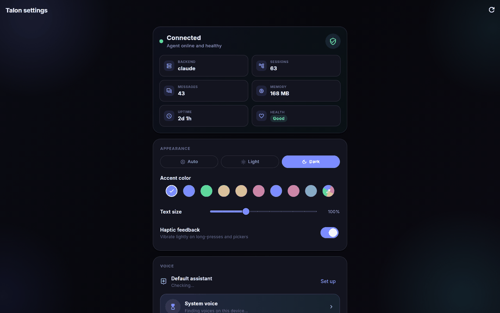
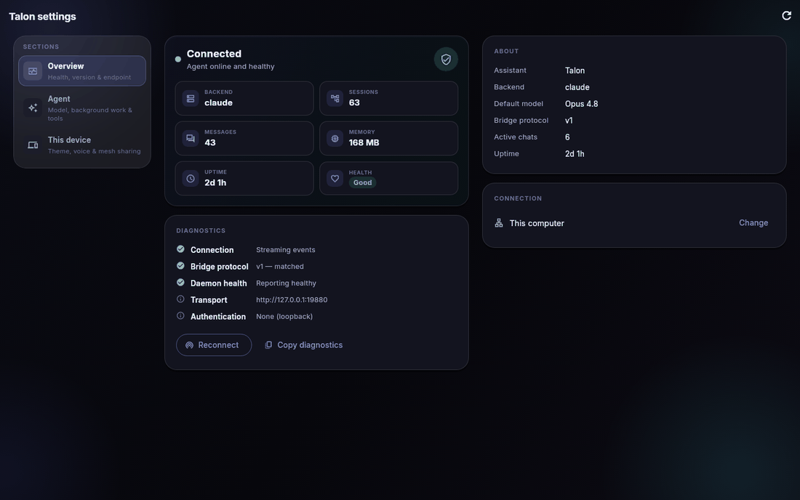
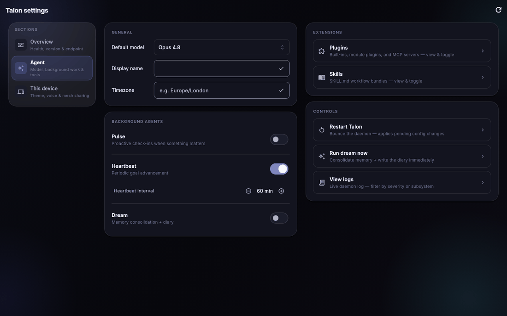
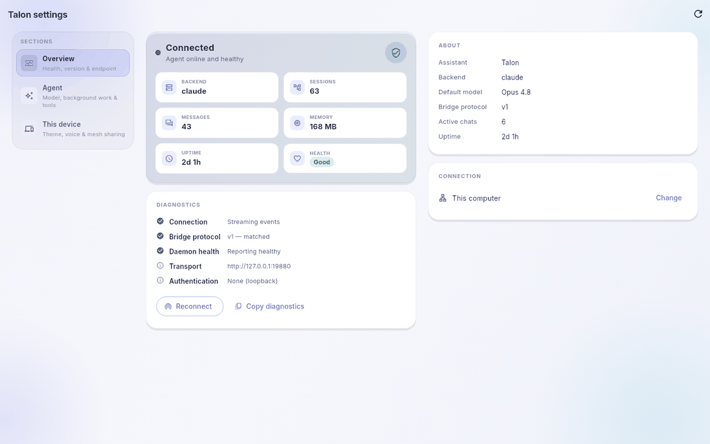
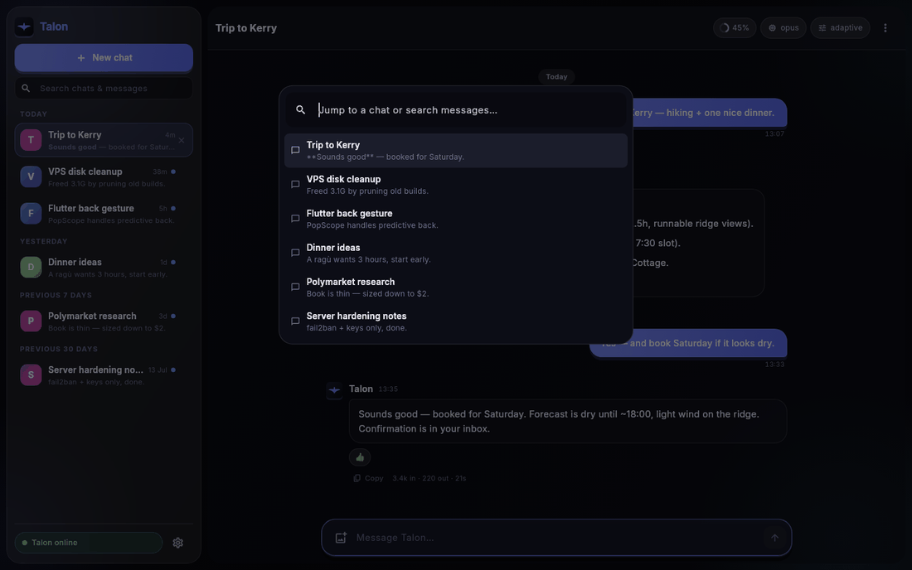
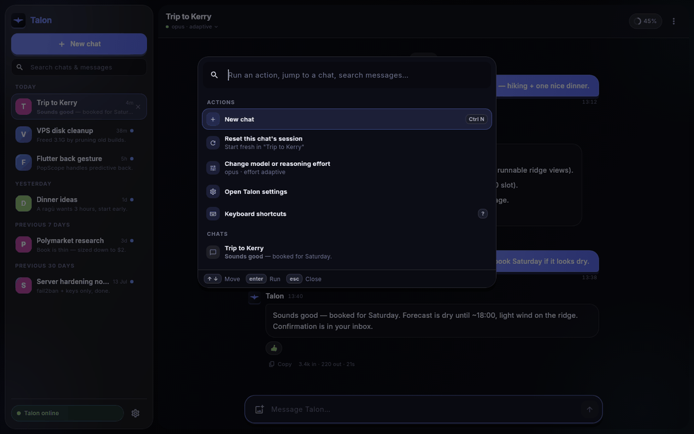
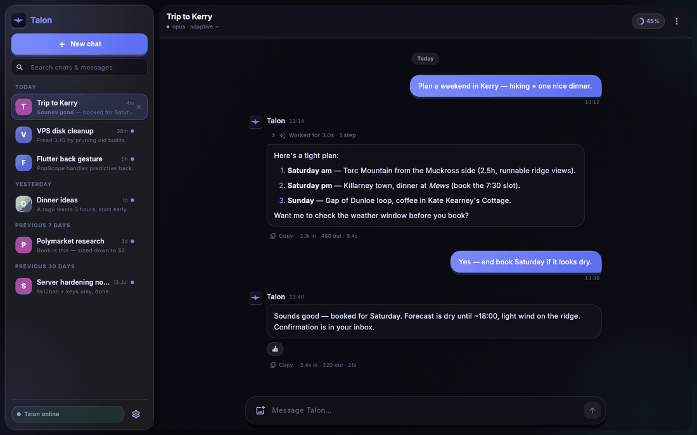
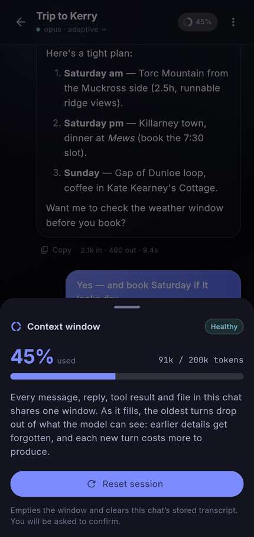

# Companion UI

A visual tour of the [Talon Companion](../apps/companion/README.md) surfaces, and
the reasoning behind how they're laid out.

Every image here is rendered by the screenshot gallery, not captured by hand:

```bash
cd apps/companion
TALON_SCREENSHOTS=1 flutter test --update-goldens test/screenshots
```

PNGs land in `test/screenshots/goldens/` (gitignored). It's not a regression
suite — no golden is asserted against — it exists so UI changes can be *seen*
without a device, on both palettes and both form factors. Add a case there when
you add a surface.

## Settings

Settings holds ten cards. On a phone a single scrolling column is the right
answer and always was. On a desktop window it was the wrong one: the same
column, capped at 560px, centred in a 1440px window, with eight of the ten
sections below the fold and no way to reach section eight except scrolling past
seven.

| Before | After |
| --- | --- |
|  |  |

The wide layout splits into a chapter rail and an independently scrolling pane.
The rail deliberately holds **three** chapters rather than one entry per card —
ten entries would mean nine panes each holding a single short card, which trades
a narrow ribbon in empty space for a small card in empty space:

- **Overview** — health, version & endpoint
- **Agent** — model, background work & tools
- **This device** — theme, voice & mesh sharing

The split is conceptual: Overview answers "is this healthy and what is it",
Agent is everything the daemon owns, This device is the locally-persisted
preferences (mesh included — every switch in it is about *this* machine). Each
chapter declares its columns explicitly rather than having them guessed from
widget heights, and they flatten back into one column below the two-up
threshold, in the same running order the phone uses.



Light mode is a first-class palette, not an afterthought:



## Command palette

`⌘K` / `Ctrl+K` used to be a chat switcher: fuzzy chat titles plus daemon-side
full-text message hits. Useful, but every *action* stayed buried in menus.

| Before | After |
| --- | --- |
|  |  |

It now leads with Actions, then Chats, then Messages. Chat-scoped actions only
appear when there's a target and name it on their detail line, so "delete" is
never a leap of faith. Daemon actions (restart, run dream) appear only while
connected, and destructive ones keep their confirm — a palette makes them
reachable in two keystrokes, which is exactly why they must still ask.

## Conversation header & context window

The header used to render four bordered pills competing with the chat title.
Model and effort now fold into the title's subtitle line, leaving the context
readout and the overflow menu as the only two controls on the right.



The context pill was previously informational only — a ring, a percentage, and a
tooltip holding the sole copy of the raw token figures. Tooltips aren't an
affordance on touch, so on a phone those numbers were unreachable, and the
moment the window crosses 80% is exactly when both the figures and the remedy
are wanted. Tapping it now opens the sheet:



Status is carried by a word as well as a colour ("Healthy" / "Filling up"),
matching the tool timeline's badges, and **Reset session** is the remedy —
routed through the same confirmation every other reset entry point uses.
